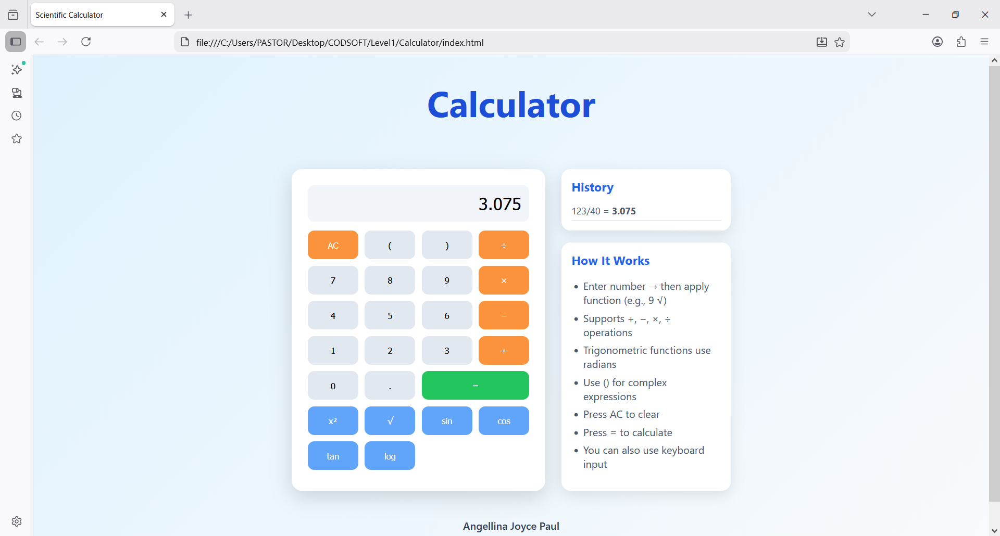

# Scientific Calculator

A modern scientific calculator built using HTML, CSS, and JavaScript with a clean UI and additional features like history tracking.

## Features

- Basic arithmetic operations (+, −, ×, ÷)
- Scientific functions (sin, cos, tan, log, √, x²)
- Bracket support for complex expressions
- Calculation history
- Keyboard input support
- Responsive design
- Interactive hover effects

## How It Works

- Enter number → then apply function (e.g., 9 √)
- Supports standard operations (+, −, ×, ÷)
- Trigonometric functions use radians
- Use brackets () for complex calculations
- Press AC to clear
- Press = to calculate
- Keyboard input is supported

## Technologies Used

- HTML
- CSS
- JavaScript

## Preview

## Author

Angellina Joyce Paul
